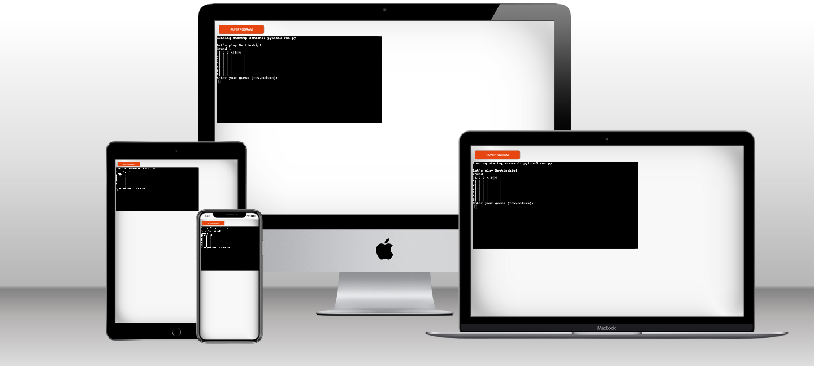
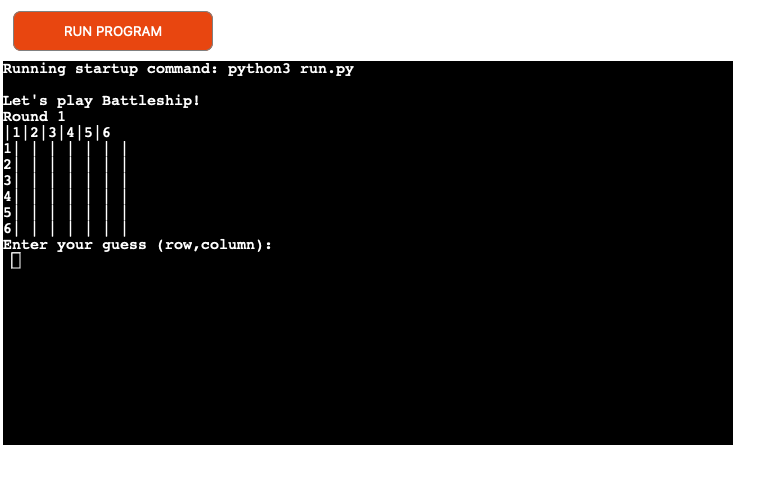
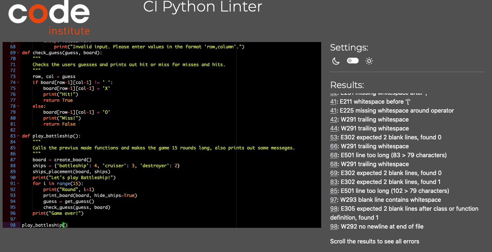

# BATTELSHIP GAME

- The site is built for the user to play a type of battelship game. The game involves the user sinking the ships that are placed on the board. If the user succeeds in sinking all the ships, the user wins. The user has 15 round's until the game ends automatically.

 

- Add a link to the live site here, for Milestone 1 this will be the GitHub Pages Link from when you deployed the site.

## CONTENTS

* [User Experience](#user-experience-ux)

* [Features](#features)
  * [Future Implementations](#future-implementations)
  * [Accessibility](#accessibility)

* [Technologies Used](#technologies-used)
  * [Languages Used](#languages-used)
  * [Frameworks, Libraries & Programs Used](#frameworks-libraries--programs-used)

* [Deployment](#deployment)

* [Testing](#testing)

* [Credits](#credits)
  * [Code Used](#code-used)
  * [Acknowledgments](#acknowledgments)

## User Experience (UX)

- From a design perspectiv the site is not so nice to look at beacuse its only build with python and no CSS or designing. But the overall user experience when people play the game they are happy. Its a fun game to play.
- The user's whu tested the game was happy about it.
- The game is built easy for the user's to understand and has simple commands to follow.

## Design

- The app is only built with a back end langue as python and has no color design or special font design. It's just a simple back end app.

## Features

### Future Implementations

- In the future I want to make the game a bit more advanced like the user to play against the computer so they can se 2 boards. Maybe with more user messeges. 

### Accessibility

- I used simple commands for the user to simple understand the game. I built it and put it up for making it easy to understand.

## Technologies Used

### Languages Used

- I used Python3 only.

### Frameworks, Libraries & Programs Used

- Github: Used to create repositry, and save the files and work on.
- Git: Git is used for veriasion control and to commit and push the work.
- Gitpod: For writing the code.
- Heroku: Used to deploy the site.

## Deployment 

- The site is deployed on heroku. 

## Testing

- For the testing i used CI Python Linter and i got some errors, not big ones but some like blank lines and spaces. 

[pep8ci](http://pep8ci.herokuapp.com/)

### Bugs

- There was a big problem with Code anywhere where I started to writing my code, I could'nt use the terminal so I was not able to run the program or to commit and push  to github for a whole day. Therefore there can be a lack of commits in the middle of the project. I solved this by using gitpod instead. 

## Credits

### Code Used

- The code used is written by me, before starting the project i looked at some youtube tutorials and googled a bit on source codes. After looked throght some works i made a plan of how to build the game and then structured it up and wrote it. 

###  Acknowledgments

- I got stuck a few times and had a hard time understanding how to write the parameters in the functions and i contacted Code institutes tutoring who helpt me understand the concept. The tutors also helpt me understand how to call all the functions in the best way.

